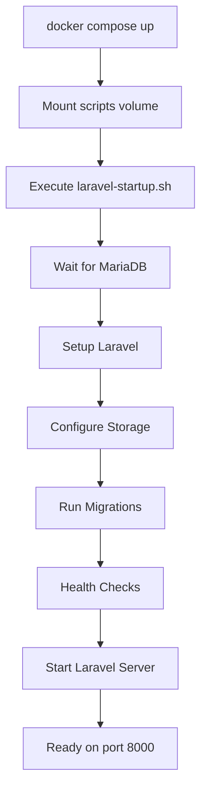

# 📜 Scripts de INFOTEC

Este documento describe los scripts disponibles en el proyecto INFOTEC y su propósito.

## 📁 Organización de Scripts

```
scripts/
└── laravel-startup.sh         # Script principal de inicio del contenedor
```

## 🚀 Script Principal: `laravel-startup.sh`

### Propósito
Script principal que ejecuta el contenedor Laravel. Reemplaza el comando inline complejo que estaba en `docker-compose.yml`.

### Ubicación en el Contenedor
- **Host**: `./scripts/laravel-startup.sh`
- **Contenedor**: `/app/scripts/laravel-startup.sh`

### Funcionalidades

#### 🔄 **Proceso de Inicialización Completo**

1. **Espera de MariaDB** (hasta 60 segundos)
2. **Creación de Laravel** (si no existe)
3. **Instalación de dependencias** (Composer)
4. **Configuración de entorno** (.env + variables de BD)
5. **Generación de APP_KEY** (si no existe)
6. **Creación de directorios de storage** (fix para Codespaces)
7. **Configuración de permisos** (775/664)
8. **Limpieza de cache** (prevención de problemas)
9. **Ejecución de migraciones** (con reintento)
10. **Verificación final** (directorios y BD)
11. **Inicio del servidor** (puerto 8000)

#### 🛡️ **Características de Seguridad**

- ✅ **Error handling**: `set -e` para salir en errores
- ✅ **Timeout control**: Límite de 60s para MariaDB
- ✅ **Retry mechanism**: Reintento de migraciones
- ✅ **Health checks**: Verificación de directorios y BD
- ✅ **Graceful fallbacks**: Comandos alternativos si fallan los principales

#### 🔍 **Logging Detallado**

Cada paso muestra:
- 🚀 Inicio de proceso
- ⏳ Estados de espera
- ✅ Operaciones exitosas
- ❌ Errores con contexto
- ⚠️ Advertencias importantes

### Ejemplo de Salida

```bash
🚀 INFOTEC - Configuración automática de Laravel
⏳ Esperando MariaDB...
✅ MariaDB disponible en puerto 3306
📁 Directorio de trabajo: /app
✅ Laravel ya existe, continuando con configuración...
📦 Verificando dependencias de Composer...
✅ Dependencias ya instaladas
⚙️ Configurando entorno Laravel...
🗄️ Configurando conexión de base de datos...
✅ Configuración de BD: MariaDB (mariadb:3306/infotec_laravel)
✅ APP_KEY ya existe
📁 Creando directorios de storage requeridos...
📄 Creando archivos .gitignore para estructura...
🔐 Configurando permisos de storage...
✅ Directorios de storage configurados correctamente
🧹 Limpiando cache existente...
✅ Cache limpiado
🗄️ Ejecutando migraciones de base de datos...
✅ Migraciones ejecutadas exitosamente
🔍 Verificación final del sistema...
✅ Todos los directorios requeridos están disponibles y con permisos correctos
🔍 Verificando conexión de base de datos...
✅ Conexión de base de datos verificada
✅ Configuración completada exitosamente
🎉 Laravel listo en http://localhost:8000
🚀 Iniciando servidor de desarrollo...
```

## 🔧 Fix de Storage Integrado

**El script `laravel-startup.sh` incluye automáticamente todas las correcciones de storage:**

✨ **Características integradas:**
- ✅ **Creación automática** de directorios de storage
- ✅ **Permisos correctos** (775 para directorios, 664 para archivos) 
- ✅ **Archivos .gitignore** para preservar estructura
- ✅ **Limpieza de cache** para prevenir problemas
- ✅ **Verificación final** de directorios y permisos

**No se requieren scripts adicionales** - todo funciona con:
```bash
docker compose up -d
```

## ⚡ Ventajas de la Organización por Scripts

### 🎯 **Mantenibilidad**
- **Código legible**: Scripts dedicados vs comando inline de 80+ líneas
- **Debugging fácil**: Logs estructurados y pasos identificables
- **Versionado**: Scripts en Git para tracking de cambios
- **Reutilización**: Scripts utilizables independientemente

### 🔧 **Flexibilidad**
- **Desarrollo local**: Scripts ejecutables fuera de Docker
- **Testing**: Pruebas individuales de cada script
- **Personalización**: Fácil modificación sin tocar docker-compose.yml
- **Multiplataforma**: Scripts específicos para cada OS

### 🛡️ **Robustez**
- **Error handling**: Manejo de errores más sofisticado
- **Retry logic**: Reintentos automáticos en operaciones críticas
- **Health checks**: Verificaciones exhaustivas
- **Graceful degradation**: Fallbacks para casos edge

## 🚀 Flujo de Ejecución



## 📋 Comandos de Desarrollo

### Ejecutar script manualmente
```bash
# Dentro del contenedor
docker compose exec laravel bash /app/scripts/laravel-startup.sh

# Ejecutar fix de storage
docker compose exec laravel bash /app/scripts/fix-storage-permissions.sh
```

### Debug del script
```bash
# Ver logs del contenedor durante startup
docker compose logs -f laravel

# Conectar al contenedor para debug
docker compose exec laravel bash
```

### Desarrollo del script
```bash
# Editar script localmente
nano scripts/laravel-startup.sh

# Reiniciar contenedor para probar cambios
docker compose restart laravel
```

## 🎉 Resultado

La migración a scripts dedicados proporciona:

- ✅ **Código más limpio** en docker-compose.yml
- ✅ **Mejor debugging** con logs estructurados
- ✅ **Mayor flexibilidad** para desarrollo
- ✅ **Mantenimiento más fácil** con archivos separados
- ✅ **Reutilización** de scripts en diferentes contextos

¡Los scripts están listos para uso en producción! 🚀